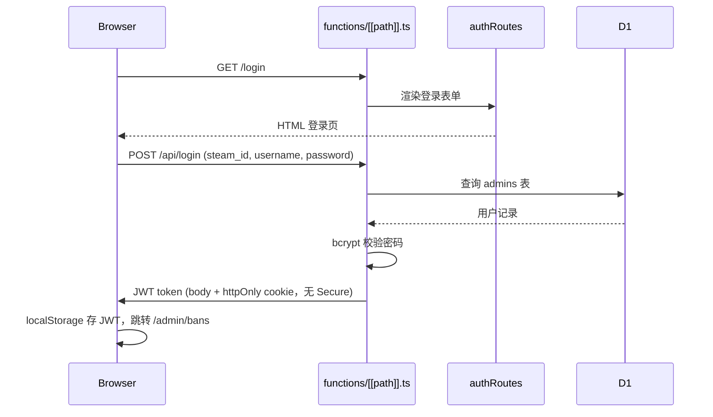
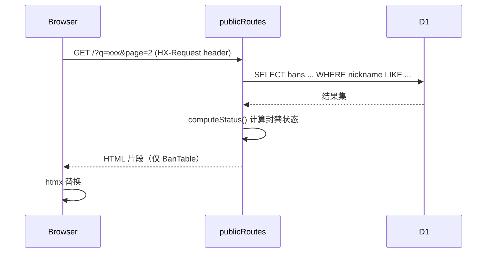
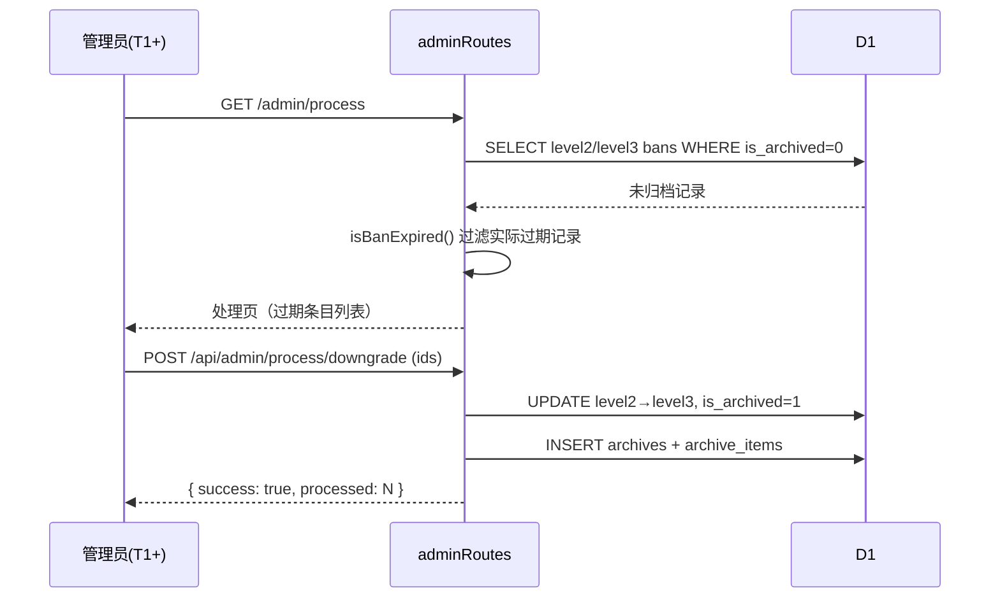
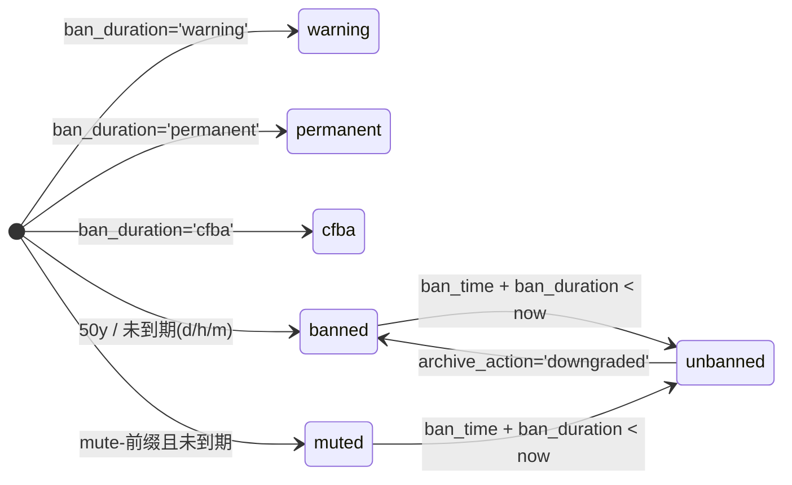
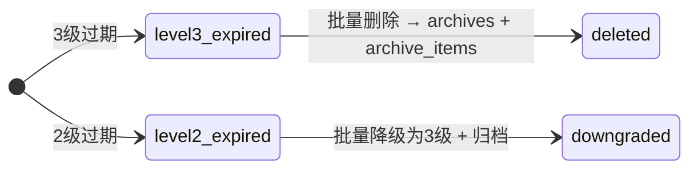

# 项目架构

## 模式概述

Hono SSR 单体应用，运行于 Cloudflare Pages Functions。服务端 `html` 模板渲染 HTML，htmx 实现无整页刷新的局部更新（搜索、翻页）。单一入口 `functions/[[path]].ts` 挂载 4 组路由。

## 系统上下文

- **玩家（访客）** — 查询封禁列表、查看统计信息、查看管理组公示，无需登录
- **管理员（T1~T6 / OWNER）** — 登录后台管理封禁、观察名单、批量处理、账户
- **Cloudflare D1** — SQLite 边缘数据库（jdcf-db，WNAM 区域）
- **Cron Worker** — 独立部署的定时 Worker（当前改为手动处理模式）

## 分层

- **入口**: `functions/[[path]].ts` — 单一路由挂载点，全局错误处理器
- **路由**: `src/routes/` — 4 组路由（public, auth, admin, account），Hono Router + RESTful JSON API
- **视图**: `src/views/` — 14 个服务端模板，两套布局（公开 `Layout` + 后台 `AdminLayout`），共享 CSS Token 系统 `styles.ts`，内联 SVG 图标库 `icons.ts`，背景图配置 `config/bg-images.ts`
- **中间件**: `src/middleware/auth.ts` — JWT 认证（双传输：header + cookie）+ 权限等级校验
- **工具**: `src/helpers/escape.ts` — HTML/属性转义，跨路由和视图共用
- **类型**: `src/db.ts` — D1 绑定类型、行类型定义

调用方向：路由层 → 视图层（渲染响应）/ 中间件（拦截校验）/ DB（数据存取）。视图层不直接访问 DB。

## 视图文件结构

```
src/views/
├── styles.ts              # Cyberpunk 玻璃态 CSS Token（共享，各视图通过 id="cyber-styles" 注入）
├── icons.ts               # 内联 SVG 图标库（24 个图标，共享）
├── layout.ts              # 公开布局 — 导航栏 + 全局添加封禁弹窗 + 动态背景 + 页脚
├── admin-layout.ts        # 后台布局 — 移动端 Tab Bar + 桌面端侧边栏（响应式）
├── home.ts                # 公开首页 — 统计卡片 + 搜索 + Segmented Control + 封禁表格 + 分页
├── stats.ts               # 统计信息页 — Chart.js 饼图/柱状图/折线图 + 数据表格
├── team.ts                # 管理组公示 — 2 列卡片网格 4:3 比例
├── login.ts               # 管理员登录页 — 独立居中布局
├── account.ts             # 账户自助管理 — Settings 风格表格
├── admin-bans.ts          # 封禁管理 — 搜索 + 表格 + 新增/编辑表单 + 分页
├── admin-process.ts       # 批量处理 — 过期违规批量删除/降级
├── admin-watchlist.ts     # 重点观察名单 — 表格 + 新增/编辑表单
└── admin-team.ts          # 管理组管理 — 表格 + 新增/编辑表单
```

## 场景序列

### 登录流程



### htmx 搜索翻页



### 批量处理过期违规



## 关键对象状态机

### 封禁状态（computeStatus 实时计算）



状态不存库，每次读取时由 `computeStatus()` 根据 `ban_duration`、`ban_time`、`archive_action` 实时算出。

### 归档处理动作



## 关键设计决策

- **[Hono + htmx 选型]** — 轻量 SSR，无需前端框架；htmx 局部搜索翻页无需整页刷新
- **[权限分级 T1~T6 + OWNER]** — GROUP_RANK 数值越小权限越高（OWNER=0, T1=6）
- **[封禁状态实时计算]** — computeStatus() 读时计算，不持久化
- **[JWT 双通道传输]** — Authorization header（API 调用）+ httpOnly cookie（页面导航，无 Secure 标志支持 HTTP）
- **[Turnstile 移除]** — CDN 国内被屏蔽，改为纯 fetch 表单提交
- **[Cyberpunk 玻璃态 UI]** — 暗色主题，`backdrop-filter: blur(8px)` 毛玻璃效果，霓虹青/品红/琥珀色板，CSS Token 统一管理
- **[多背景图系统]** — CSS `background-image` 多图层（随机图 + 3.jpg 兜底），`<link rel="preload" fetchpriority="high">` 提前加载，`window.onload` 预填缓存
- **[Chart.js 统计图表]** — v4 CDN，饼图 `aspectRatio: 1`，自定义 `afterDraw` 插件显示百分比标签
- **[全局添加封禁弹窗]** — 导航栏按钮调用 `openGlobalBanSheet()`，弹窗在 `layout.ts` 中定义，确保所有页面可用
