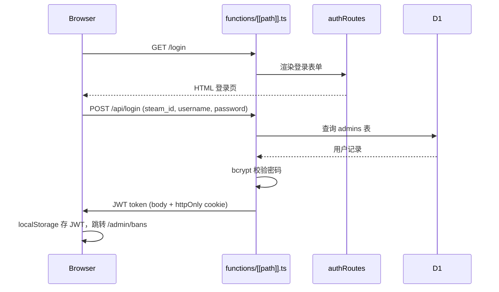
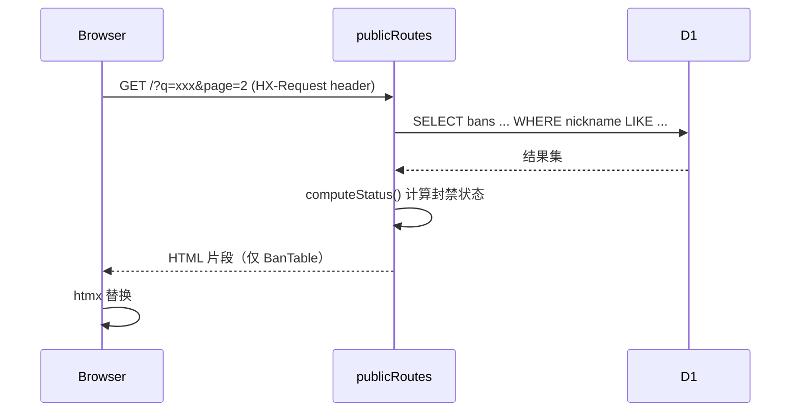
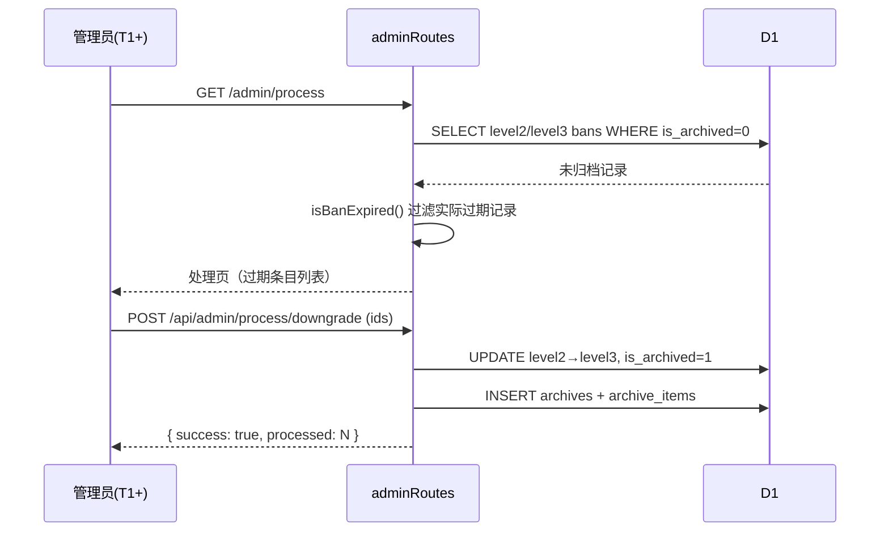
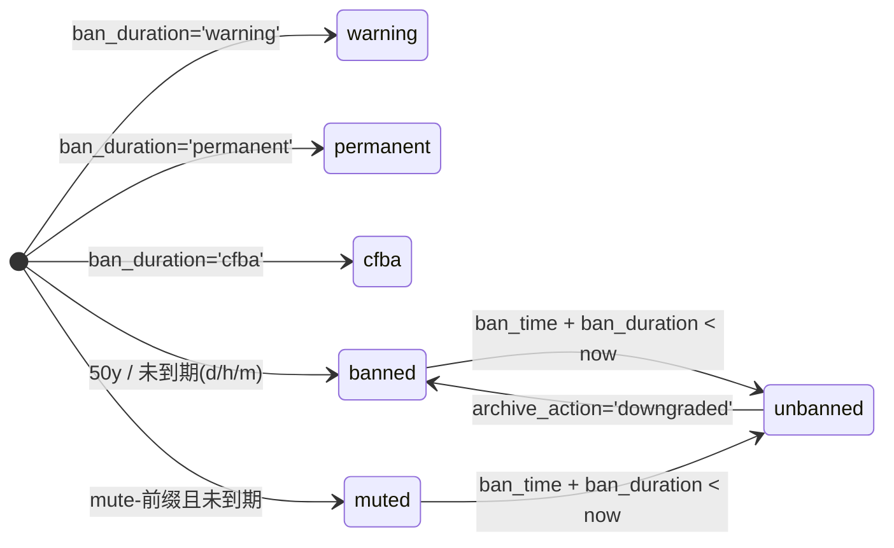
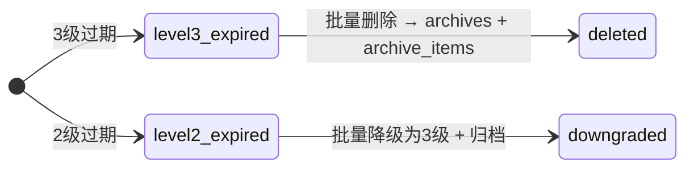

# 项目架构

## 模式概述

Hono SSR 单体应用，运行于 Cloudflare Pages Functions。服务端 JSX 渲染 HTML，htmx 实现无整页刷新的局部更新（搜索、翻页）。单一入口 `functions/[[path]].ts` 挂载 5 组路由。

## 系统上下文

- **玩家（访客）** — 查询封禁列表、查看管理组公示，无需登录
- **管理员（T1~T6 / OWNER）** — 登录后台管理封禁、观察名单、批量处理、账户
- **Cloudflare D1** — SQLite 边缘数据库（jdcf-db，WNAM 区域）
- **Cron Worker** — 独立部署的定时 Worker（当前改为手动处理模式）

## 分层

- **入口**: `functions/[[path]].ts` — 单一路由挂载点，CORS 中间件
- **路由**: `src/routes/` — 5 组路由（public, auth, admin, adminTeam, account），Hono Router + RESTful JSON API
- **视图**: `src/views/` — TSX 服务端模板，两套布局（公开 `Layout` + 后台 `AdminLayout`），独立 CSS Token 系统 `styles.ts`，内联 SVG 图标库 `icons.ts`
- **中间件**: `src/middleware/auth.ts` — JWT 认证（双传输：header + cookie）+ 权限等级校验
- **工具**: `src/helpers/escape.ts` — HTML/属性转义，跨路由和视图共用
- **类型**: `src/db.ts` — D1 绑定类型、行类型定义

调用方向：路由层 → 视图层（渲染响应）/ 中间件（拦截校验）/ DB（数据存取）。视图层不直接访问 DB。

## 视图文件结构

```
src/views/
├── styles.ts              # iOS 设计系统 CSS Token（共享，各视图通过 id="ios-styles" 注入）
├── icons.ts               # SF Symbols 风格 SVG 图标（14 个，共享）
├── layout.tsx             # 公开布局 — 底部 Tab Bar（封禁列表/管理组/登录）
├── admin-layout.tsx       # 后台布局 — 移动端 Tab Bar + 桌面端侧边栏（响应式）
├── home.tsx               # 公开首页 — 统计卡片 + 搜索 + Segmented Control + 封禁表格 + Bottom Sheet
├── team.tsx               # 管理组公示 — iOS Grouped List
├── login.tsx              # 管理员登录页 — 独立居中布局
├── account.tsx            # 账户自助管理 — Settings 风格 Grouped Table
├── admin-bans.tsx         # 封禁管理 — 搜索 + 表格 + Bottom Sheet 新增
├── admin-process.tsx      # 批量处理 — 过期违规批量删除/降级
├── admin-watchlist.tsx    # 重点观察名单 — Bottom Sheet CRUD
└── admin-team.tsx         # 管理组管理 — 表格 + Bottom Sheet 新增/编辑
```

## 场景序列

### 登录流程



### htmx 搜索翻页



### 批量处理过期违规



## 关键对象状态机

### 封禁状态（computeStatus 实时计算）



状态不存库，每次读取时由 `computeStatus()` 根据 `ban_duration`、`ban_time`、`archive_action` 实时算出。

### 归档处理动作



## 关键设计决策

- **[Hono + htmx 选型]** — 见 `docs/superpowers/specs/2026-06-05-jdcf-ban-list-design.md`
- **[权限分级 T1~T6 + OWNER]** — GROUP_RANK 数值越小权限越高（OWNER=0, T1=6）
- **[封禁状态实时计算]** — computeStatus() 读时计算，不持久化
- **[JWT 双通道传输]** — Authorization header（API 调用）+ httpOnly cookie（页面导航）
- **[Turnstile 移除]** — CDN 在国内被屏蔽，改为纯 fetch 表单提交
- **[iOS 风格 UI 重构 2026-06]** — 采用 iOS 深色系统色板 + SF Pro 字体 + 纯色分层背景，CSS Token 统一在 styles.ts 中管理，所有新组件使用 `ios-` 前缀类名
